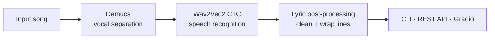

# AI Lyric Detection System


An end-to-end **lyric transcription pipeline**: separate the vocals from a mixed song, transcribe them with a speech model, and clean the output into readable lyrics.

The repository ships as a reusable Python package with a CLI, a REST API (with job progress), a Gradio UI, plus **fine-tuning** and **WER evaluation** scripts.

---

## Pipeline



| Stage | Tool | Output |
| --- | --- | --- |
| 1. Vocal separation | [Demucs](https://github.com/facebookresearch/demucs) `htdemucs` | Isolated vocal stem (`*_vocals.wav`) |
| 2. Transcription | Hugging Face CTC model (default `facebook/wav2vec2-base-960h`) | Raw text |
| 3. Post-processing | Pure-Python helpers | Lowercased, de-punctuated, line-wrapped lyrics |

---

## Quick start

```bash
# 1. Install dependencies (PyTorch first — see pytorch.org for CUDA builds)
pip install -r requirements.txt

# 2. Transcribe a song
python -m lyric_detector.cli path/to/song.mp3 --output-dir outputs

# 3. Or launch the web UI
python -m lyric_detector.gradio_app

# 4. Or run the REST API
uvicorn "lyric_detector.api:create_app" --factory --reload
```

### REST API

```
POST /transcribe          multipart upload → { job_id, status_url }
GET  /jobs/{job_id}       → { status, stage, progress, lyrics }
GET  /health
```

```bash
curl -F "file=@song.mp3" http://127.0.0.1:8000/transcribe
```

---

## Fine-tuning

Fine-tune a CTC model on your own audio/transcript pairs (CSV with `audio,text` columns):

```bash
python scripts/fine_tune_wav2vec2.py \
  --data data/train.csv \
  --base-model facebook/wav2vec2-base-960h \
  --output-dir models/wav2vec2-lyrics \
  --epochs 10 --batch-size 4
```

## Evaluation

Measure transcription quality with **Word Error Rate (WER)** (CSV with `audio,reference` columns):

```bash
python scripts/evaluate_wer.py data/test.csv --limit 50
```

---

## Project structure

```
.
├── lyric_detector/
│   ├── config.py          # dataclass configuration
│   ├── separator.py       # Demucs vocal separation (lazy imports)
│   ├── transcriber.py     # Wav2Vec2 CTC transcription (lazy imports)
│   ├── pipeline.py        # end-to-end orchestration + progress callbacks
│   ├── text.py            # lyric cleaning / wrapping (pure)
│   ├── metrics.py         # WER + Levenshtein (pure)
│   ├── evaluation.py      # dataset-level WER evaluation
│   ├── api.py             # FastAPI service with background jobs
│   ├── gradio_app.py      # Gradio interface
│   └── cli.py             # argparse CLI
├── scripts/
│   ├── fine_tune_wav2vec2.py
│   └── evaluate_wer.py
└── tests/                 # stdlib unittest — no ML dependencies required
```

## Design notes

- **Lazy heavy imports** — `torch`, `demucs`, `transformers`, `fastapi`, and `gradio` load only when the stage that needs them runs, so the core package and tests stay lightweight.
- **Pure logic is unit-tested** — WER, text cleaning, and evaluation have no ML dependencies and run in CI in seconds.
- **Progress reporting** — the pipeline accepts a callback, which the API uses to expose real-time job progress.
- **Swappable models** — pass any Demucs model or Hugging Face CTC checkpoint via config/CLI flags.

## Notes

- Model weights download on first run (plan ~1–2 GB); a GPU is strongly recommended, CPU works for short clips.
- Lyrics transcription is hard: overlapping vocals, ad-libs, and effects all hurt accuracy. The evaluation script is there to measure it honestly.

## Author

**HeiChan (Chan Hei Lun)** — BEng in Information Engineering, CUHK
[github.com/ChanHei419](https://github.com/ChanHei419)
